# Mount Your Oscilloscope to a Monitor Arm

Want to free up bench space and get your oscilloscope positioned exactly
where you need it? This guide shows how to create a custom VESA bracket
for mounting an oscilloscope to a monitor arm.

We'll look at two fabrication methods (woodworking and 3D printing) and two attachment options, both of which require disassembling your scope and drilling holes through the enclosure.

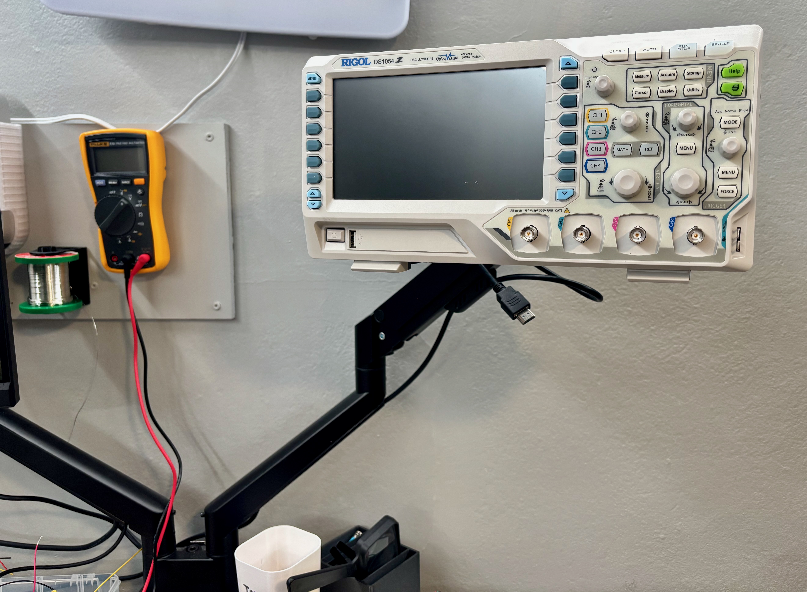

*Rigol DS1054z oscilloscope mounted on desktop monitor arm using custom VESA bracket.*

---

# Introduction and Overview

## Project Overview

This is a straightforward DIY project that should take
1-2 hours.

The goal is to create a simple bracket from wood or 3D-printed plastic
that will be used to attach your oscilloscope to a desktop monitor arm.

It requires comfort with modifying electronic equipment and
using basic tools like a drill and screwdriver.

### Cost Estimate

- **Wood:** Under $20 for a 3/4" plywood project panel
- **3D printing filament:** Under $2 per 60-gram bracket
- **Fasteners:** $10-$20 for metric screw/washer/nut assortment

*Approximate USD, as of 2025.*

### General Steps

*3D-printed bracket joining a VESA quick-release mount to an oscilloscope.*

The basic process involves several steps: disassemble your oscilloscope to identify secure
attachment points, drill access holes through the enclosure,
design and fabricate a custom bracket, test the fit, and finally
install the bracket and attach it to your monitor arm.

There are two different bracket attachment options:

1. **Chassis Standoffs**: Use existing threaded standoffs or holes inside the oscilloscope's chassis. This provides a clean attachment to the internal frame.

2. **Enclosure Through-Bolts**: Drill new holes through the oscilloscope's back enclosure and secure the bracket with bolts and large washers.

*Chassis attachment method: Bracket screws directly into internal threaded standoffs, with VESA mounting plate attached to the outer face of the bracket.*

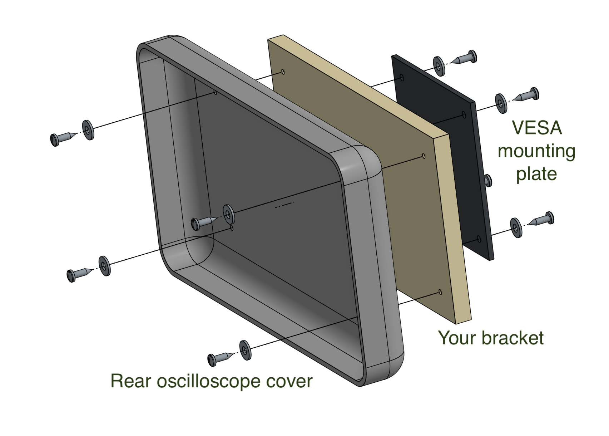

*Enclosure attachment method: Through-bolts pass through enclosure, bracket, and VESA mounting plate, secured with washers on the inside.*

Both approaches are detailed in the Attachment Methods section below.

Throughout the guide, I'll be illustrating the project with my Rigol
DS1054z ([CAD model](https://cad.onshape.com/documents/ef9345c3b520a6787b4ed32c/w/bbb075982a44ab3c73b5c766/e/971e0995b79195641f8665d2?renderMode=0&uiState=69236f0c857e9db964bf2d66)).

### What You'll Need

Prerequisites:

- A lightweight oscilloscope
- A desktop monitor arm or wall mount that is rated to handle the weight
  of your scope

Measurement and marking:

- Inexpensive digital calipers or a ruler
- Paint marker to transfer hole locations to the enclosure or bracket
  easily
- Masking tape if you need to transfer contours or outlines to your
  wooden bracket

Fasteners:

- Screws, washers, and nuts:
  - Screws that match preexisting holes in your scope's chassis,
    probably metric sizes like M3 or M4 (3 or 4 mm diameter). A kit of assorted sizes is $10-$20.
  - M4 (metric) or #8 (imperial) or larger fasteners with washers if you are attaching your bracket to the enclosure
- Bolts or screws to attach your VESA mount plate to the bracket. Small VESA
   patterns typically use M4 screws.

Basic tools and materials:

- Drill with bits to make holes in the oscilloscope enclosure
- Standard screwdriver for assembly
- Specific screwdriver to remove oscilloscope screws, like a "precision" set with
  interchangeable bits ($15-$40)
- Woodworking tools:
  - Safety equipment: eye, hearing, and lung protection
  - 1/2" (12 mm) or thicker wood stock
  - Saws:
    - Small hand saw or Japanese-style pull saw for straight cuts
    - Jigsaw or coping saw to cut curves
  - Forstner drill bits or chisel if you need to cut recesses into the wood
  - Sandpaper:
    - Low grit (80) to remove sharp edges and prevent splinters
    - Higher grits if you want a smooth finish
- 3D printing needs:
  - Basic CAD application
  - 3D printer (local library or schools may provide access)
  - Filament (PETG recommended)

## Why VESA?

VESA is an industry organization that sets standards for video product
interoperability. They define a
[Flat Display Mounting
Interface](https://en.wikipedia.org/wiki/VESA_mount), known as a "VESA
mount", which is used by most
TVs and computer monitors.

For our purposes it's just
a square hole pattern, either 75×75 mm or 100×100 mm, with M4 metric
screws.

In other words, any monitor arm or wall mount bracket you might purchase
for a display will use one of the VESA hole patterns.

Mounting your oscilloscope onto a desktop monitor arm brings the same
benefits it brings to a monitor, including more bench/desktop space,
better ergonomics, and flexible positioning for different tasks.

**Note:** My monitor arm has a quick-release mechanism, which is shown in the photos. If yours doesn't have this feature, attach your scope directly to the monitor arm's VESA plate.

Verify that your monitor arm can hold twice your scope's weight, and consider what would happen if your bracket failed.

## Safety and Disclaimer

Beyond typical DIY and electronics hazards, be aware of these additional risks:

- You may damage your oscilloscope and will probably void your warranty.
- You are putting a physical load on the scope in ways that it was not
  designed for, which could lead to other damage or injury if the scope
  falls off of your monitor arm.

While this project only requires basic DIY skills, carefully consider whether the risks are worth it and whether your oscilloscope and mounting system are appropriate for this use case.

Please don't proceed if you aren't willing to completely destroy your
oscilloscope!

## A Note on Photos

I created three different brackets for my scope, so you may see some
holes and marks in a picture that aren't applicable to the current step
in the guide.

---

## Open Your Oscilloscope

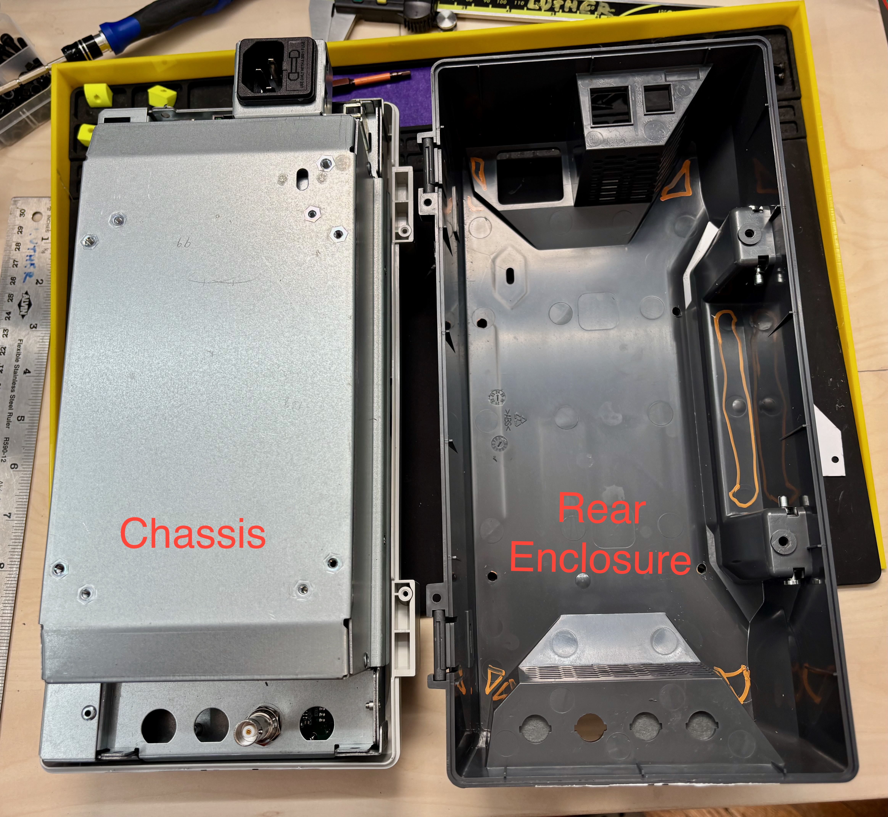

*Rigol DS1054z with enclosure separated, revealing chassis with
standoffs on the left and a plastic enclosure on the right.*

To determine the best attachment method, open your oscilloscope and
examine its internal structure. Every enclosure differs, so search online
for your model's service
manual or teardown guides to make disassembly easier.

**Note:** In this guide, "enclosure" refers to the outer plastic housing
or rear cover of the oscilloscope, while "chassis" refers to the internal metal frame.

Remove the screws holding the enclosure together. Look for screws hidden under rubber feet or the handle.

A special screwdriver may be required, possibly Torx (star-shaped) or
hexagonal. Some screws have a "security pin" requiring
screwdriver bits with a hole in the center. Some screws may require a very long driver to reach.

Take photos or use a screw organizer to track which screws go where.
Screws can vary in size, thread pitch, and length. It is important to
replace the screws in their original locations to avoid stripping the
threads, damaging internal components, or not actually fastening the
connection.

Watch for internal tabs that snap into place. Remove these carefully to avoid damaging the tabs or internal components.

## Warning: Internal Wiring

After removing the fasteners, don't just crack open the enclosure! There
may be internal components that are connected to each other by short or
fragile cables, like a power supply attached to one half of the enclosure that
provides DC voltage to a board attached to the other half.

Check for these cables as you separate the parts of the oscilloscope.

My
scope's rear enclosure is easily removed, but
further disassembly would require disconnecting some cables.

As with screws, keep careful track of which connections go where if you
disconnect anything.

## Example: Rigol DS1054z

I'll use my Rigol DS1054z scope as an example throughout.

Prior to starting this project, I discovered most of what I needed to
know from this [EEVblog teardown
video](https://www.youtube.com/watch?v=lJVrTV_BeGg), which saved me the
effort and risk of major disassembly to study the innards.

Reference photos from this [EEVblog Blog
Post](https://www.eevblog.com/2014/10/15/eevblog-674-rigol-ds1054z-teardown/)
(thanks, Dave!)
illustrate what's available to use for this project.

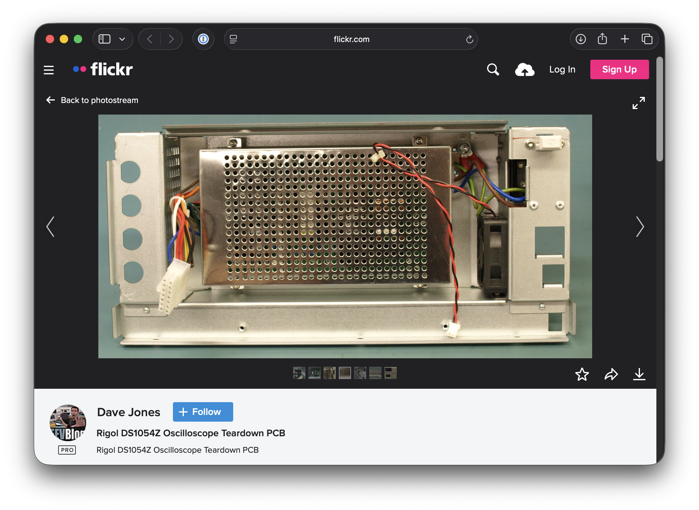

- [Inside view](https://www.flickr.com/photos/eevblog/14919421894/)
  showing some promising threaded inserts
- [Detail of the power
  supply](https://www.flickr.com/photos/eevblog/14919420054/) which
  explains what those standoffs are being used for

Disassembly was easy. There are two screws next to the front feet and
two behind the handle. Keep track of which screws go where! The foot
screws have the coarser thread. There are no internal cables to
disconnect.

*Rigol DS1054z disassembly: remove screws near feet (left) and behind handle (right).*

---

## Attachment Methods

With your oscilloscope open, look for ways to attach a bracket. This
guide presents two options.

1. **Existing Chassis Standoffs**: Use threaded holes or standoffs
   already present inside the oscilloscope, like those in the Rigol
   DS1054z. This provides a clean, simple attachment to the internal
   chassis.

2. **DIY Enclosure Attachment**: Drill new holes through the
   oscilloscope's back enclosure and attach the bracket using screws or
   bolts with large washers. This method might work for more
   oscilloscopes, assuming the enclosure is strong enough.

*Left: Chassis with screws placed into existing threaded standoffs.
Right: Enclosure with holes drilled and screws inserted (screw heads are painted orange).*

## Two Fabrication Methods

Once you know your attachment method, choose how to build the bracket:

1. **3D Printing**: Design and print a custom bracket. This works well with chassis standoffs and allows for precise fitting around enclosure contours.

2. **Woodworking**: Cut a bracket from wood using basic tools. This pairs well with enclosure attachment and requires no specialized equipment.

For simplicity, this guide pairs chassis standoffs with 3D printing, and enclosure attachment with woodworking. However, the methods are interchangeable—you can use any combination that works for your oscilloscope.

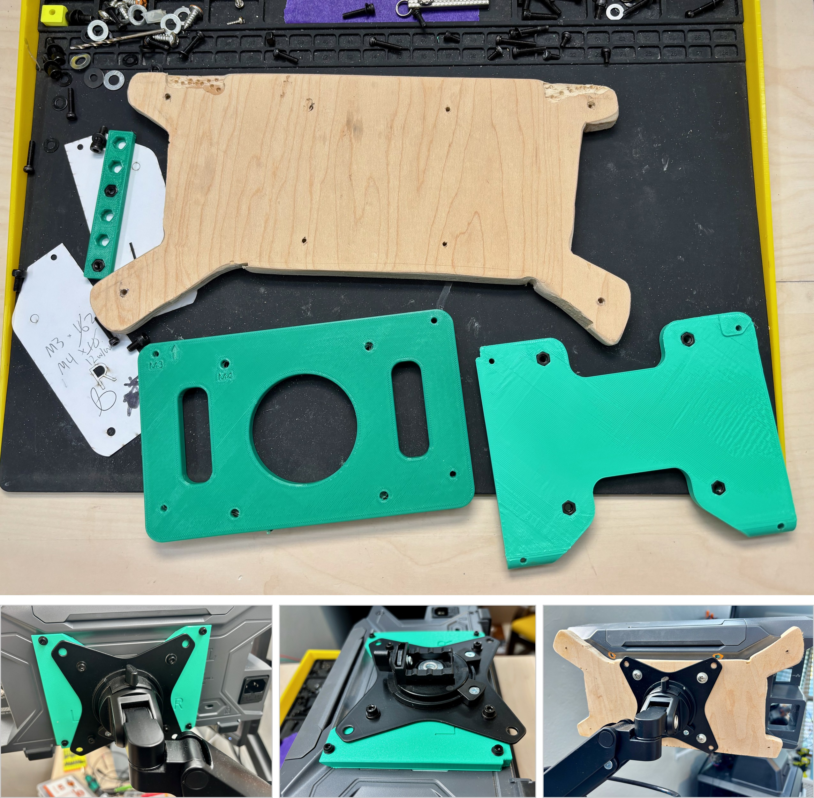

*Three brackets: wood, simple 3D print, 3D print that follows enclosure contours.*

## Existing Standoffs

My Rigol DS1054z has existing threaded standoffs (metal spacers with
internal threads) on its chassis that make the project straightforward.
These standoffs hold the internal power supply and a circuit board, but the screws don't
run the entire length, leaving threads available for bracket attachment.

*Eight chassis standoffs are available, with some M3 screws inserted for measurement.*

---

## DIY Enclosure Attachment Points

If chassis standoffs aren't an option for your oscilloscope, the second
approach is to create your own attachment points by drilling through the
enclosure.

If your scope doesn't have any good existing attachment points, you may
be able to find spaces inside the enclosure that will accommodate
screws or bolts.

The strength of this attachment depends on the thickness and strength of
the scope's enclosure. If space allows, you may be able to increase the
strength of the connection using large washers or rigid plates behind
the enclosure. Use as many connection points as you need.

*Identify safe drilling locations (marked in orange) in cavities between internal components.*

---

## Validating the Attachment Method

Look for threaded inserts or other usable structures on the chassis.

If you find something promising, investigate
further. **Example:** I found 8 threaded holes in the rear frame of my scope.

*Rear view of oscilloscope enclosure showing through holes (marked in
orange) that correspond to the hole locations in the chassis.*

Test different screw sizes gently to avoid damaging threads. Check the available depth—ensure enough thread engagement for strength.

If you don't find any usable attachment points or your investigation
reveals challenges, consider the enclosure method.

Each method is detailed below.

### Chassis Attachment Method

The next step in this method is to get more information. To avoid
injury and damage, you need to know: what is on the other
side of the holes? Are the attachment points strong
enough?

Based on the [teardown
photos](https://www.flickr.com/photos/eevblog/14919420054/) and
examination through the vent, I found that four of the standoffs attach the power
supply to the
chassis, and four hold a circuit board. The photo clearly illustrates that the chassis is
grounded, so connecting to the chassis should not pose an electrical
hazard.

Next, examine the enclosure to ensure you can access the
chassis connections from the outside.

**Example:** I had to make a trade-off. The holes I wanted to use allow
me to avoid any contours or obstacles on the enclosure, but those holes only allow for 2 mm of thread engagement. The other holes have more space,
but the bracket design is more complicated due to the enclosure's shape. For this guide, I demonstrate brackets designed for both the shallow-thread and deep-thread standoff locations.

### Enclosure Attachment Method

If you don't find any suitable chassis attachment points, consider
the enclosure as another option to attach your bracket to the
oscilloscope.

Consider the strength of the enclosure using this option.

My scope's rear enclosure is made of thick ABS plastic, so I took the risk that it would be strong
enough to use for this project.

Check for safe spaces to place fasteners. Each location needs room for a screw head and large washer, with no risk of touching electronic components.

A washer is critical to spread out the forces on the enclosure. Use the
largest washer (or stack of washers) that you can for each hole.

Mark the candidate locations with a paint marker.

#### Do you need a bracket?

If you are really lucky, you might be able to put your screws through
the enclosure and directly connect it to your VESA mounting plate!

If so, simply place your VESA plate  or hole pattern onto the back of the enclosure and
mark the hole locations.

Drill holes, fasten the plate on with a bolt and washers, and call it a
day!

Please note that I don't recommend making holes in the chassis.

## Enclosure Pass-through Holes

Once you've identified your attachment points (either chassis standoffs or
DIY enclosure locations), drill access holes through the
back of the enclosure for the fasteners that will connect your bracket to
the oscilloscope.

For the chassis attachment, transfer the hole locations
to the enclosure. Determine the locations through careful
measurement, or use a paint marker for easier transfer. Insert short screws
into the holes so that the heads are all flush with each other, apply
paint to the heads, and then carefully place the enclosure back into
place. Press firmly over each screw. Then remove the enclosure and check
the paint transfer.

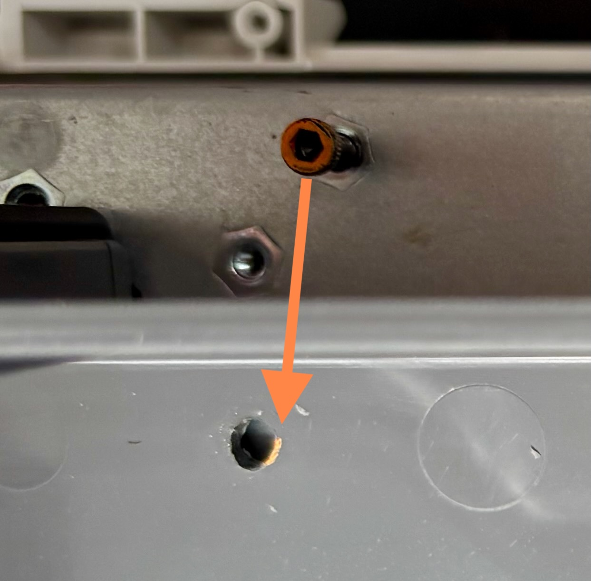

*Paint marker transfer method: paint on screw heads (top) and drilled hole at paint-transferred location (bottom).*

Drill clearance holes for the fasteners.

---

## Bracket Design

With the enclosure prepared and your attachment method determined, it's
time to design the bracket that will securely connect to the oscilloscope and
provide a way to securely attach a VESA mounting plate:

1. Place holes for the fasteners that will connect to the scope.
2. Choose a location for the VESA hole pattern that is compatible with
   the other fastener locations and the shape of your enclosure.
3. Determine the appropriate thickness of the bracket based on the
   required strength and fastener lengths.

## Fabrication Choice

Choose your fabrication method. This guide covers 3D printing and woodworking.

*Wooden bracket and 3D-printed bracket shown for comparison.*

The woodworking option is about as simple as a woodworking project can
get, and it doesn't require any fancy or expensive tools.

## 3D Printing

*Simple 3D-printed bracket.*

If you've chosen to 3D print your bracket, you have two design options depending on the shape of your oscilloscope's back enclosure: a simple rectangular bracket for flat enclosures or a contoured bracket that accommodates curves and obstacles.

Any CAD program and slicer will work for this project. I provide an
Onshape model for reference.

*Onshape CAD model showing simple rectangular bracket with VESA hole pattern and captive nut pockets.*

*PrusaSlicer screenshot.*

The bracket needs to be strong enough to hold the scope and thick enough to
accommodate the fasteners.

The strength comes from a combination of the thickness, material
strength, and print settings (like speeds and infill). Make test parts to
validate your design choices.

**Example:** My bracket is 11 mm thick and was printed in PETG with 25% internal fill density. I used my slicer's "structural" setting, which slows down the print moves.

Measure your oscilloscope's screw
placement and place the VESA hole pattern. Shape the bracket outline to match your enclosure's
characteristics, test the fit and strength, and print the final part.

### Step 1: Measure Scope Screw Placement

Determine the position of each screw relative to the others. Then
determine the approximate position of the screws relative to the
enclosure.

For holes not in a rectangular grid, optionally transfer the hole
locations to a piece of graph paper and measure the x and y distances
with a ruler.

For holes in a grid, place screws into the scope holes and measure the distances
between them. Measure from hole center to hole center.

Inexpensive calipers make this measurement easy. Place the calipers
onto the
screw shaft and zero them. This subtracts the screw
diameter from your next measurement, which is from the far side of one
screw to the far side of the other. This will give you the distance
between hole centers. If you don't have calipers,
measure with a ruler.

*Left: Zero calipers on screw shaft. Middle: Measure center-to-center
distance. Right: Record measurements.*

Identify
important measurements for the placement of the hole pattern based on your enclosure's shape. **Example:** My scope has a protruding contour for the handle, so my
bracket must avoid or accommodate it.

Record your measurements on paper or in your CAD program.

### Step 2: Place VESA Pattern

The objective of this step is to find a position of the VESA mounting
plate that doesn't complicate assembly, doesn't interfere with ports or
vents, and fits within the space you have.

The specific hole pattern is dictated by the VESA mount you have.
It will most likely be 75×75 mm or 100×100 mm.

Define the placement of the VESA holes relative to your scope
attachment holes.

### Step 3: Create and Validate the 3D Model

These are the basic steps to design the model:

1. Place the hole patterns.
2. Design the rough shape of the bracket.
3. Create a way to securely fasten the VESA plate.
4. Extrude to final thickness.

#### Place Holes

In your favorite CAD program, sketch the hole patterns and critical
measurements. In my design, I first placed the hole patterns with the origin
in the center, and then I drew the shape of the bracket. You may decide
to do it in a different order.

For the simple version of my bracket, the attachment hole pattern is 146×78 mm. The VESA
pattern is 75×75 mm, and its center is about 10 mm lower than the center
of the attachment hole pattern. The top attachment holes are about 10 mm
away from the contour that I want to avoid.

Decide how much material to place around each hole. I chose 10 mm
wherever possible. Draw a rectangle outset from your outer holes by that
amount.

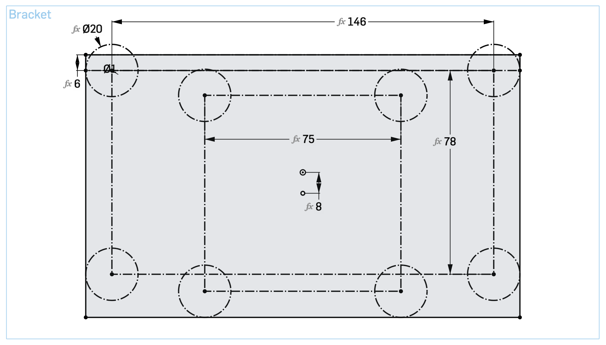

*CAD sketch of hole locations and basic outline.*

With the hole pattern set, it is time for the first fit test.

There's no need to invest the time and cost to 3D-print the entire part. Instead make a
print of the pattern, either by exporting your sketch and printing it on
paper or 3D-printing only the first 1 mm of the model. Place
the test pattern onto the scope, place the VESA mount (if possible), and
install the screws. Adjust your model as needed, and repeat the process
until you are happy with the fit.

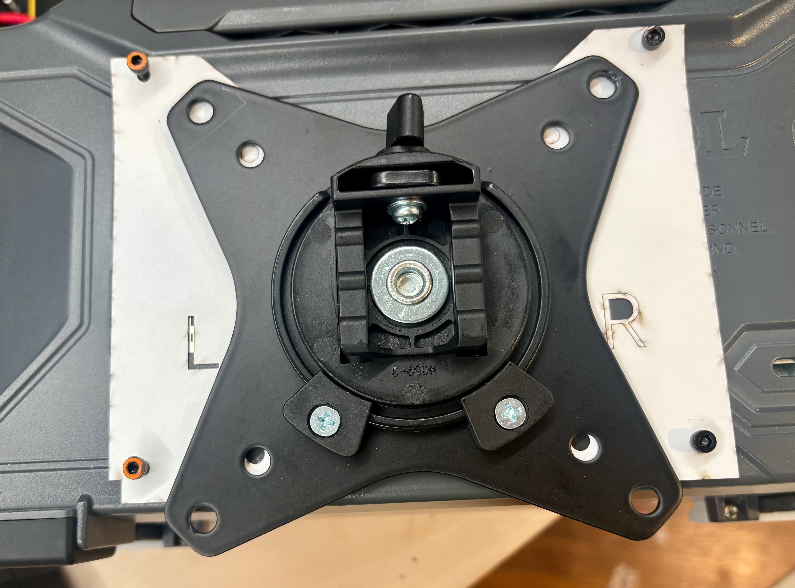

*Testing hole alignment with paper cutout.*

#### Sketch Outline, Extrude, and Make Holes

If you haven't already, sketch the outline of the bracket.

Ensure that the bracket does not interfere with access to ports or
obstruct any vents.

Extrude the bracket to your desired thickness. Expect to adjust this dimension as needed while testing and validating your design.

Make screw clearance holes by extruding a circle or using your CAD
program's hole tool (which should make it easier to adjust the size and
fit).

**Tip:** For Onshape's hole tool, sketch the hole locations
with a construction rectangle, and draw 1 mm circles around each
hole. When using the hole tool, those 1 mm circles make it
easier to use the mate connector selection.

#### Design VESA Plate Connection

To connect the bracket to the VESA mounting plate, I am using M4 screws
with captive M4
hex nuts on the underside of the bracket. "Captive" simply means placing a nut into a pocket that keeps the nut
from turning.

To add this to your bracket, sketch a hexagon that is
centered with the screw hole. Measure the width of the flats on the nut
(M4 nuts should be 7 mm). Add 0.1-0.4 mm to make the nut easy to insert.
Dimension your hexagon accordingly.

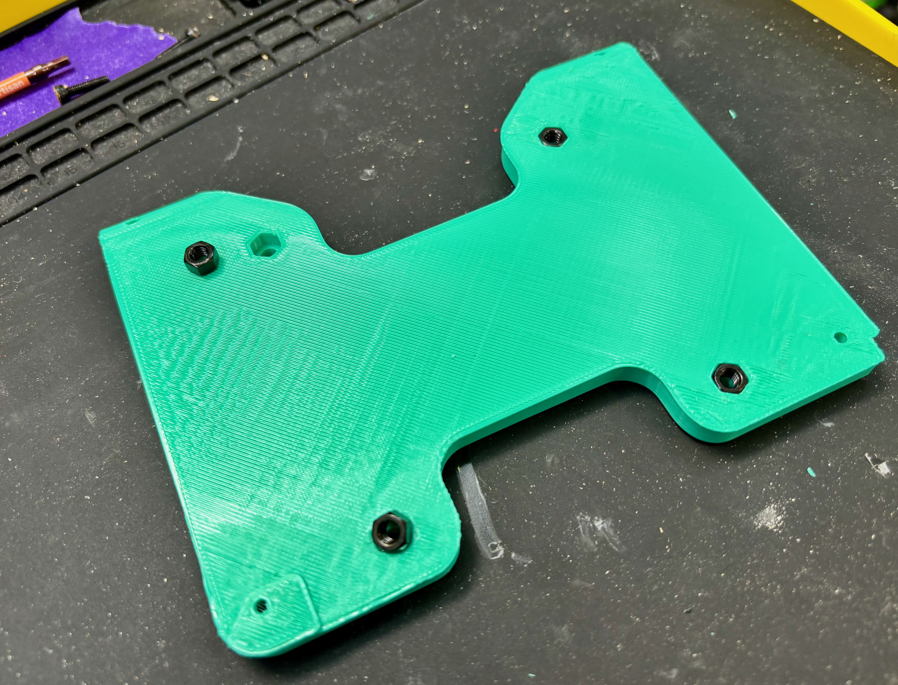

*Hexagonal pockets in 3D-printed bracket hold captive M4 nuts for secure VESA plate attachment.*

*Close-up showing M4 hex nut seated in hexagonal captive pocket.*

*VESA plate attached to back of bracket.*

*Front view of VESA plate showing captive nuts.*

To determine the depth of the pocket, measure the thickness of the nut
and decide how far the end of the screw will protrude from the nut. If
there is not enough space, the screw will bottom out into the scope
enclosure. Extrude the pocket to that depth.

Consider making a test part with different nut width dimensions to see
which works best for you.

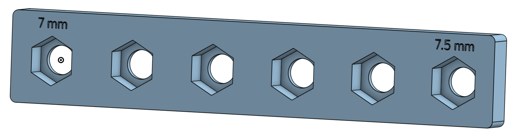

*Simple fit test tool model.*

##### Onshape Text Tip: Variables in Labels

You can use variables in text labels in sketches, but the process is not
very intuitive.

First, create a text element in your sketch.

Inside the text dialog, right click on the text entry field and select
"Convert to expression."

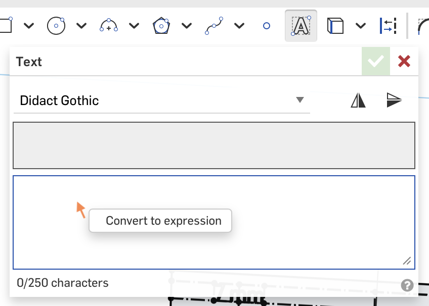

To show "7 mm" in my sketch, I have a variable `#baseWidth` set to 7 mm.
This is the expression:
`roundToPrecision(#baseWidth/mm, 3) ~ " mm"`

If I want to use this fit test tool for another size of nut, I just have
to change the value of `#baseWidth`. The labels will automatically
update.

See the [documentation](https://cad.onshape.com/help/Content/text-sketch.htm) for more details.

#### Finalize Design

By this point, you should have been able to test the bracket's shape,
hole layout, and strength. Double check that the bracket will not
obstruct vents or ports.

The last critical design step is to choose the specific
fasteners that will be used and adjust the bracket's thickness to match.
Be sure to include washers in the design.

This is also the time to apply comfort features, like chamfers and
fillets, and remove any unnecessary material to save printing time and cost.

#### Print

Optimal print settings depend on the bracket design, filament choice, and printer capabilities.

For reference, I printed one of my brackets on a Prusa Mini printer with
PETG filament and PrusaSlicer's preset for "0.2 mm STRUCTURAL" and 25%
infill.

Place the captive nuts into the pockets on the underside.

#### Reassemble and Install

Before installing the bracket, reassemble the oscilloscope. Refer to your notes to
ensure each screw is placed into the correct location and that all screws are used.

Install screws by hand, and don't overtighten them.

Use the largest washers that fit your design.

After installing all screws, perform these final checks:

- Tighten each screw to similar torque to distribute load evenly across
  all the mounting points
- Verify no large gaps exist between the parts
- Wiggle the bracket to confirm no play or movement

Finally, place the scope onto the monitor arm and secure the quick-release
mechanism. You're ready to move on to your next electronics project!

*Completed 3D-printed bracket attached to oscilloscope rear with VESA quick-release mechanism installed.*

### Contoured Bracket Design

If your scope's back enclosure has curves, obstacles, or recesses (like my Rigol DS1054z), you'll need to modify your bracket design to accommodate these features for a snug fit.

As mentioned above, my scope's chassis hole pattern that allows for
longer screws to be used has downsides: it places two of the holes in the
middle of a curved surface and one in a recess in the enclosure.

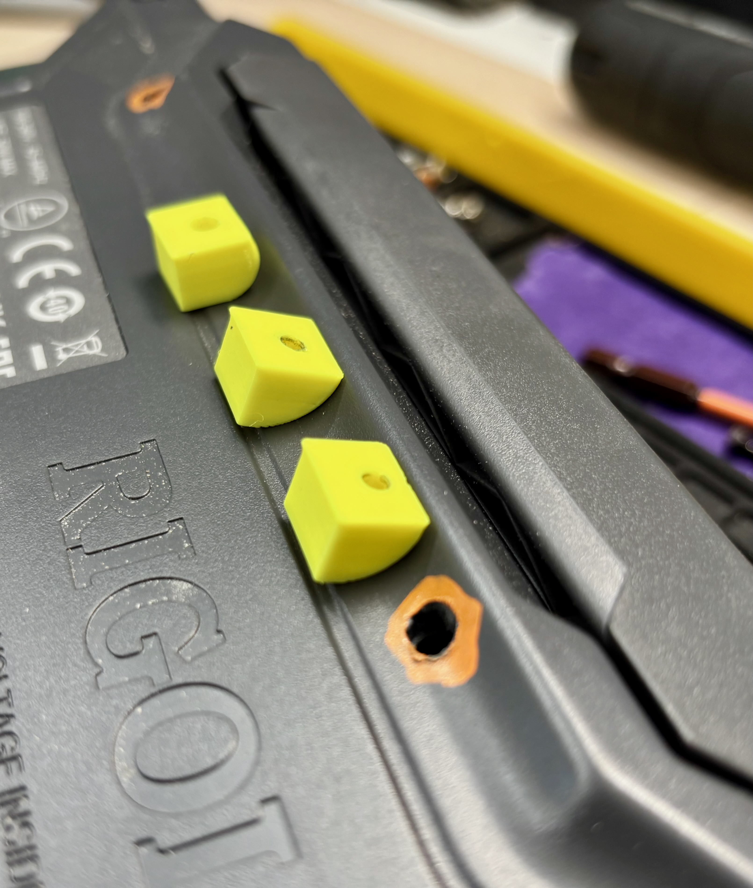

*Yellow test blocks with different radii determine curve shape.*

To get a snug fit between the bracket and the enclosure, I needed to
account for those features in my design.

I measured the depth of the depression
with the end of the calipers and noted the required space between the holes and the edges. Then I extruded the shape to that depth.

Matching the curve took more effort. I approximated the curve's radius
with calipers and then made small test blocks with different radii and
hole placements. The better the fit, the more evenly the stress will be
spread across the enclosure. Based on the tests, I sketched the final
profile and extruded away the excess material.

*Final contoured 3D-printed bracket showing cutout to accommodate handle protrusion and curved surfaces.*

---

## Woodworking

*Wooden bracket installed.*

This is a straightforward woodworking project that requires only basic
tools and little to no previous experience.

This portion of the guide pairs woodworking with the enclosure
attachment option.

Assuming a simple oscilloscope enclosure shape, the
simplest bracket assembly will be a rectangular block of wood with eight screws
and washers. Otherwise, cut a conforming outline with a saw.

To use the enclosure attachment method with my Rigol scope, the holes
end up at the far corners of the unit, which makes the wooden bracket
more involved due to the curves and obstacles on the back.

The fabrication process follows these steps: select appropriate wood stock, then determine the
bracket outline based on your oscilloscope's shape. Cut the
basic form, remove additional material for clearance as needed,
sand the edges smooth, drill mounting holes, and install the
fasteners.

## Select Wood

Select wood thick enough to
accommodate the screw lengths you want to use and strong enough for the
purpose. **Example:** I used a 1/2" (12 mm) piece of plywood from my scrap bin.

## Create the Outline

If the hole placement and enclosure shape are simple, a rectangular outline
may suffice. Otherwise, sketch
the right shape for your situation.

Create a template. I recommend using masking tape.

Apply a layer of masking tape to the back of the enclosure, then use a
marker to trace around all of the obstacles.

Carefully peel the tape template off in one piece and place it onto the
wood stock.

Transfer the marks to the wood using a hobby knife or pen that leave a visible impression.

Then mark all of the cut lines in pencil. Clearly designate which side of
the line is to be cut.

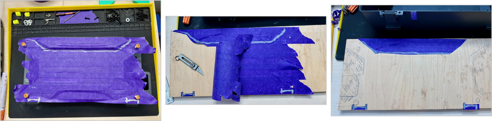

*Left: Masking tape applied to enclosure. Middle: Template transferred
to wood. Right: Cut lines marked with indications of which side to
remove.*

## Cut the Bracket

Use the saw of your choice to remove the material you marked out.

For a jigsaw, I find it convenient to drill holes at the corners of each
cut.

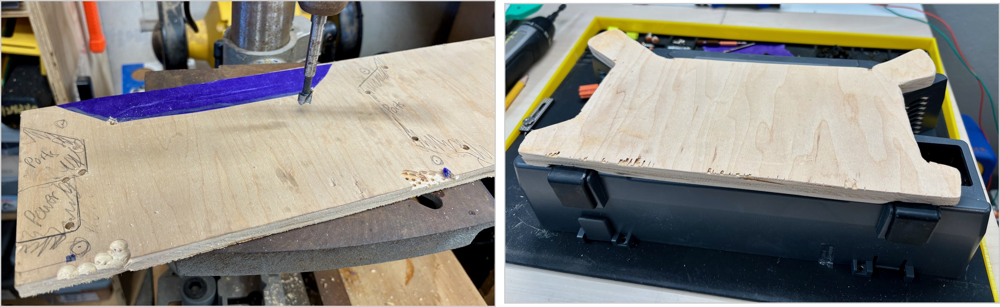

*Left: Drill press with Forstner bit installed. Right: Test fit of bracket.*

### Partial Material Removal

I had to accommodate the scope's bottom feet for my bracket. Because the
screws were so close to the edge of the wood, I wanted to retain
as much material as possible, so I carved out space instead of cutting
away the whole section.

Use a chisel, router, or drill to remove the material. **Example:** I used a drill press with a Forstner (flat-bottomed) bit. The drill
press makes it easy to set a stop and get the same depth on each plunge.

Sneak up on the cut line, removing a little bit at a time and
testing the fit against the enclosure.

## Sand Edges

Sand the edges smooth to avoid splinters. **Example:** I used 80 grit sandpaper.

## Drill Holes

It's finally time to drill the holes into the bracket. Start with the
scope mounting holes first because the alignment is less critical.
Then drill holes for the VESA pattern, which should be aligned square
with the edges of the scope.

If you are using screws and plywood, it's not strictly necessary to
pre-drill the holes. You could just drive the screws straight in! I have
more success when I pre-drill: it's easier to ensure the holes are
centered, there is less of a chance of splitting the wood, and it's
easier to redrill a small pilot hole than to fill and redrill a large
hole if you need to make adjustments.

### Mark Hole Patterns

Transfer the hole locations from your enclosure to the bracket by
placing the enclosure on top of the bracket, with the inside of the
enclosure facing you. Mark the center of each hole or trace the hole's
outline.

For the VESA holes, if you have a quick-release mounting plate, mark the holes in the same way as
above. If you don't, measure and mark out your 75×75 mm or 100×100 mm pattern.

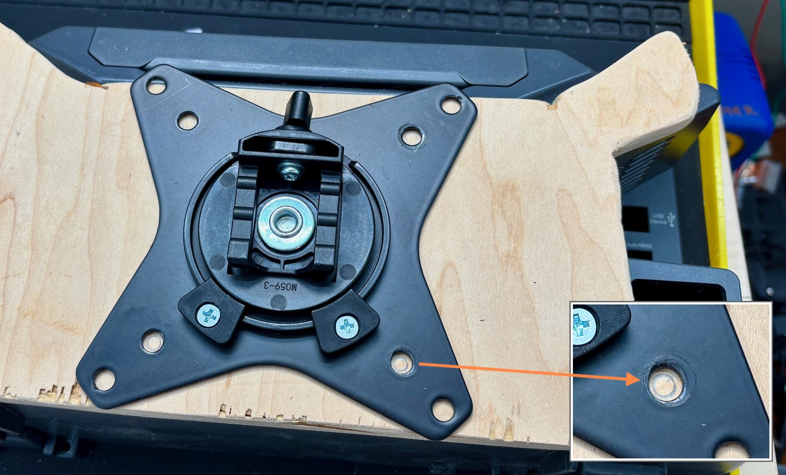

*Position VESA plate on bracket to mark mounting hole locations accurately.*

### Drill Holes

Decide whether to use screws or through-bolts (a screw with a
nut).

For bolts, select a drill bit as wide or slightly larger than your screw
and make clearance holes.

For screws, predrill the hole based on the screw size. I find that predrilling is
worthwhile for accurate placement and to prevent splitting.

The goal with predrilling is
to create room for the screw shaft while leaving material for the
threads to fully engage. This reduces the risk of splitting the wood,
and it makes it much easier to drive the screw.

Search online for "predrill chart" to find the correct drill size. If
you don't know the screw's size, find
a drill that is about the same size as the main shaft of the screw, excluding
the threads. It doesn't have to be perfect.

## Install the Fasteners and Reassemble

Depending on your hole locations and fastening strategy, determine whether to attach the
enclosure or the VESA mount first.

To spread out the stress on your oscilloscope's
enclosure, use the largest washers that will fit in the space you have.
For bolts, use washers for both the screw head and the nut.

*Main view shows complete wooden bracket installation. Inset shows the
washer placement.*

Drive screws carefully. First, install all the screws with a loose fit.
Then position the two parts and tighten the screws. Do not over-tighten
the screws: your goal is for the parts not to move, but you should not
be deforming the surface of your enclosure or the washers. Tighten bolts
in a similar way.

## Verify Fit and Clearance

Before final assembly, verify:

- Parts are flush with each other, with no play (movement) between them
- Screws are not hitting any electronic components
- All ports are accessible
- No vents are obstructed

If all checks pass, reattach the scope enclosure. Refer to your notes to
ensure each screw is placed into the correct location and that all
screws are used.

Finally, attach the scope to your monitor arm and fully secure it.

---

# Conclusion

## What You've Accomplished

You've added VESA mounting to your oscilloscope, which opens up flexible positioning options and frees up valuable bench space.

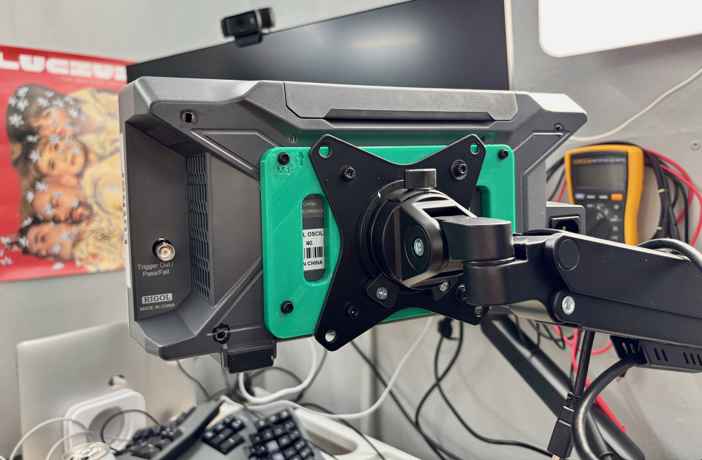

*Back view showing bracket integration with monitor arm and quick-release mechanism.*

*Close-up rear view of contoured bracket installed with VESA quick-release mechanism.*

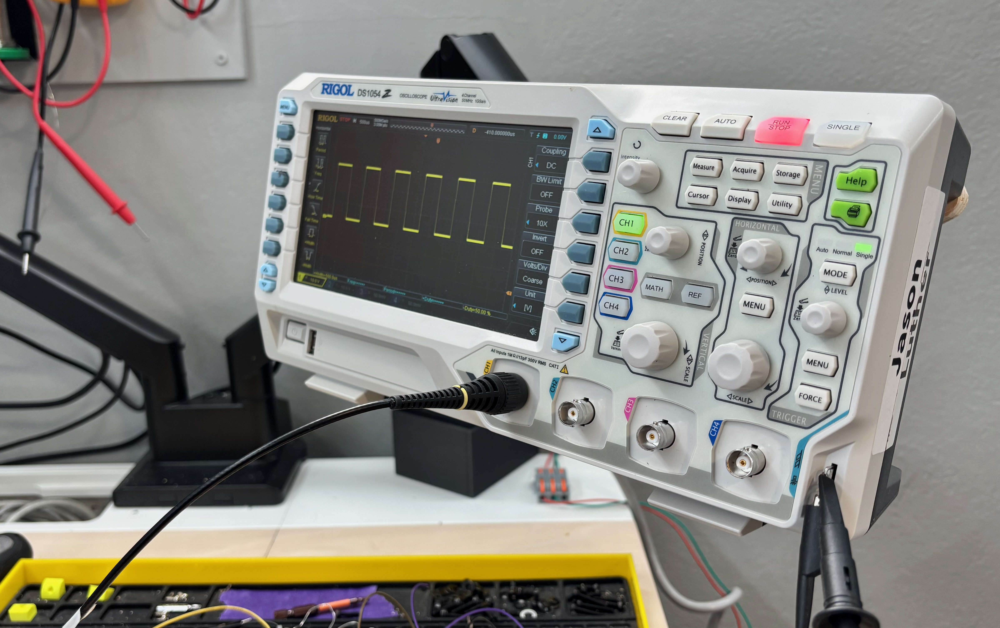

*Front view of completed VESA-mounted oscilloscope positioned on desktop monitor arm.*

## Links

- Github: <https://github.com/jasonluther/oscilloscope-mount>
- Instructables: <https://www.instructables.com/Mount-Your-Oscilloscope-to-a-Monitor-Arm/>

&copy; 2025 Jason Luther. All rights reserved.
